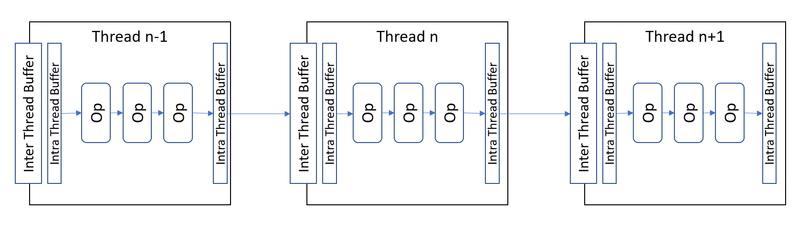

# Capstone project in Udacity's CppND
This is the final Capstone project in Udacity's Nano degree in C++. I chose to have my own project and implement something I have been thinking about for a while. Below, you have the presentation of the problem, the solution idea and a short description of implementation details.

# The problem
If you want to take advantage of the power of today's CPUs, you need to be prepared for parallel execution of your code. Between multi threads and multi processes, threads are lighter, but have the disadvantage that if one part of the code crashes, the whole application goes down. On the other hand, processes are heavier, but can make the system more stable.

However, most of the systems that I am working with, often real time and embedded, do need a complete and healthy system to provide their services properly. In such cases, multi threaded solutions can be very attractive.

An example could be machine vision. You capture an image and want to extract information, and communicate it with another device, while next image is captured. And of course, the higher numebr of frames per second the faster you can react and do more. Or in otherwords, the more value you can create.

From another perspective, image processing can often be divided into smaller tasks, which can be executed one after the other, in a pipeline. And of course, a pipeline that is designed with attention to the hardware architecture will become efficient. Unfortunately, this seldom happens. It sounds strange, but often hardware is designed so that existing software packages can be used with as little modifications as possible.

With this background, the problem to be solved is to look for an architecture that allows building processing pipelines is a flexible and fast way. In addition, it should not have penalties in terms of momory usage.

# Solution ansatz
Figure below shows the solution that I have tried to evaluate. The pipeline is a chain of operators that start from a source, or producer of data, and ends at a sink, the consumer of result. When we execute the pipeline on a multithreaded architenture, we need to divide it into groups of operators that will run on the same thread and need to exchange data with other groups running on other threads. 

<p align="center">
</p>

This of course a simplified view. A more general view would be that the pipeline might branch and more than one pipeline would preferably run in parallel and then merge together. But it can be a first prototype to test the idea.

# Implementation
Every operator is implemented as the comptational units with a function that should be executed. Operator has inputs and outputs that must be linked to neighboring operators. Schematically, this can be written as:

```
....
OP1.input(OP2.output());
OP2.input(OP3.output());
....

```
As long as these operators are running within the same thread, there are no risks for complications like data race. Their function will be executed in series and data will move from one operator to another.

In my experiement, I implemented the interface between two operator within the same thread with a shared pointer. The pointer is created by one of the operators and shared with the other.

At the boundary of the threads, things become more complex. Within the thread, the data can be shared, but between the thread, we need a mechanism that avoids data race and also synchronizes between the threads.

In my test, I have a unique pointer for the internal buffer, whose data can be used by the adjucent operator, but managed by the unique pointer. Between the threads, I have a 'unique buffer', with an architecture similar to a queue, but with one element. In the core of this buffer, there is a unique pointer whose memory allocation is the buffer between the two threads. The unique buffer is wrapped in a shared memory, to allow the two neighboring internal threads connect to it.

Before the execution of the first operator starts, the thread requests data from the unique buffer. If there is data available the two unique pointers swap their data, if not, the receiver has to wait for fresh data to arrive.

By doing so, there will not be any need for allocation, deallocation or copy of data, which is an efficient way of exchanging information. In addition, the two thread, as elements of the pipeline, will stay synchronized.

Practically, the two threads will connect with a similar syntax as two operators. If we call the opjects as EX1 and EX2, standing for executer, we will have

```
....
EX1.input(EX2.output());
EX2.input(EX3.output());
....

```
A noteworthy point here is that after the swap, the data needs to be accessed by the operators. This is arranged by the operator leaving its input and output pointers to the executer object and let it connect the pointer to right data address.

# Details of file and code structure
The figure above, although simple, it presents the structure of the code quite sccurately, except one point that is not shown. A chain of operators, as well as their wrappers, have always a start and an end. The elements in the middle need to have both input and output, while the start element, source will only have an output and the end element, the sink, has only input.

The importand output of the project is the framework that allows setting up a multithreaded pipeline of smaller operators. It is efficient both in terms of execution and memory usage. The framework is implemented as a number of  class templates, divided in three header files:
1. `src/hpp/operator.hpp` is implementing templates for a source, a sink and an operator, all of them being drived from the same base class. Having the same base class allows execution of the respective operation, regardless the exact types of data bassing through the operators. The only different between the three classes is whether they have both input and output, or only one of them.
2. `src/hpp/opsexecuter.hpp` has the implementation of operattors' executers that host a number of operators, connects them to the world outside and executes their operation. Similar to the operators, executers are drived from the same base class, which implements the common parts. The difference between the three classes is only input and output configuration.
3. `src/hpp/uniquebuffer.hpp` has the implementation of the unique buffer as explained above. It allows exchange of data between two threads in a controlled manner, without risk for data race.

To use the platform, first the data structures used through the pipeline should be. Thereafter, the data types should be used as arguments for generation of valid classes. These data structured define all interfaces between the operators and executers.

Once domain specific classes are defined, objects can be defined to build the complete pipeline. They should be wired together so that the data can flow between them. This has been done with simple mathematical operators as test for the platform and also by wrapping opencv operators in one of tutorials.

The functionality of the platform is tested using googletest. The operators are defined in `test/classdefs.hpp` and the test cases in `test/test_complete.cpp`. There are 8 detailed test cases that prove the system works properly.

To have a more interesting, or maybe so called real life test case, I took a simple case of opencv and implemented in a set of operators. Here, you have the original [opencv tutorial](https://docs.opencv.org/3.4/db/d28/tutorial_cascade_classifier.html), and the modified version, in `cascade_classifier_singlethread.cpp`. It took me about two hours to convert it to a code that I ran on three threads, basically because of mistakes and time that was needed to debug it.

A walkthrough of `cascade_classifier_multithread.cpp` illustrates the mention steps well. First, a data structure is defined that allows transfer of relevant information through the pipeline:

```
struct ImageData
{
    filesystem::path destinationFile;
    Mat frame;
};
```
With the data structure defined, we can use that as template arguments and drive the classes. Three classes, `CVFileReaderOp`,  `CVFileWriterOp` and  `CVDetector` are defineing the operations we need. Lines 30 to 114 are the definitions and then steps 1 to 9 between lines 230 and 276 show the process described in words above.

The code has lots of comment. With the above explanation you will be able to understand what I have been trying to do.

# Project rubrik
## README 
The problem and solution idea are presented. The code architecture is described in details, including the file structure. Rubrik points are presented and reference given.
## Compiling and Testing 
Cmake and make are used for build anf googletest for unit testing. The programs and tests compile and run without warnings or errors.
## Loops, Functions, I/O
All points are accounted for. See lines 140 to 230 in `cascade_classifier_multithread.cpp`. 
## Object Oriented Programming
All points are accounted for. See for example class template `OperatorExecuter` line 168 in `src/hpp/opsexecuter.hpp` and forward.
## Memory Management
A specific goal of the project was to use as little memory as possible and avoid memory allocation or copying. This has been achieved by use of smart pointers and allowing work with same resources whereever possible.
Destructor of the BaseExecuter class joins the threads, line 75 in `src/hpp/opsexecuter.hpp`. The project uses swap between unique pointer to avoid copying or allocating data. See lines 49 abd 64 in `src/hpp/uniquebuffer.hpp`. Smart pointers are extensively used. For example see input and output methods in class template `OperatorExecuter` line 168 in `src/hpp/opsexecuter.hpp` and forward.
## Concurrency
Concurrancy is the core of the project and different aspects are accounted for. The evidences can be found in `src/hpp/opsexecuter.hpp` and `src/hpp/uniquebuffer.hpp`, where the basis for multithread implementation is implemented. Mutex and lock, as well as condition variables can simplest be found in `src/hpp/uniquebuffer.hpp`. Promise and future are used to discover that a thread has complete its work.

# Repository and file structure

```console
├── CMakeLists.txt
├── README.md
├── imgs
│   ├── 14_modified.jpg
│   └── threads.png
├── input_files
│   ├── 01.jpg
│   ├  .......
│   ├── 15.jpg
│   └── haarcascades
│       ├── haarcascade_eye_tree_eyeglasses.xml
│       └── haarcascade_frontalface_alt.xml
├── outputs
│   ├── multithread_output
│   │   ├── cascade_classifier_multithread.log
│   │   ├── test_core.log
│   │   ├── test_core_valgrind.log
│   │   └── your_last_processed_images_multithread
│   │       ├── 01_modified.jpg
│   │       ├   .............
│   │       └── 15_modified.jpg
│   └── singlethread_output
│       └── your_last_processed_images_singlethread
│           ├── 01_modified.jpg
│           ├   .............
│           └── 15_modified.jpg
├── src
│   ├── cpp
│   │   ├── cascade_classifier_multithread.cpp
│   │   └── cascade_classifier_singlethread.cpp
│   └── hpp
│       ├── operator.hpp
│       ├── opsexecuter.hpp
│       └── uniquebuffer.hpp
└── test
    ├── classdefs.hpp
    └── test_complete.cpp

12 directories, 64 files
```

# How to run the program
Firstly, I need to inform that the code has been tested on WSL2/Ubuntu 20.4. I tried to make the camera work, but failed. That is the reason I have changed the code to reading from files and writing on files.

On my computer, I had opencv from earlier projects, so I was good. If you do not have it, you need to install version 4.1 or newer. I had 4.5.5 at the time of testing. Other than that, I use `filesystem` so you need to have the tool chain for C++ 17.

Other than that, I guess the process is the standard one as follows:

```console
$ git clone https://github.com/SaidZahrai/CppND-Capstone
$ cd CppND-Capstone
$ mkdir release
$ cd release/
$ cmake -DCMAKE_BUILD_TYPE=RELEASE ..
$ make
```
It compiles and creates three executables: `cascade_classifier_multithread`  `cascade_classifier_singlethread`  and `test_core`.

`test_core` is the test cases mentioned above. If you run it, you should have the below output. Stay in `release` directory and run

```console

```console
$ ./bin/test_core
Running main() from /home/said/CppND-Capstone/release/_deps/gtest-src/googletest/src/gtest_main.cc
[==========] Running 8 tests from 2 test suites.
[----------] Global test environment set-up.
[----------] 4 tests from OperatorTest
[ RUN      ] OperatorTest.ChechOneOperator
[ INFO     ] Test of operator 1 int -> float.
[       OK ] OperatorTest.ChechOneOperator (0 ms)
[ RUN      ] OperatorTest.CheckTwoOperators
[ INFO     ] Test of int -> float -> floor.
[       OK ] OperatorTest.CheckTwoOperators (0 ms)
[ RUN      ] OperatorTest.LinkedTwoOperators
[ INFO     ] Test of linked operators.
[       OK ] OperatorTest.LinkedTwoOperators (0 ms)
[ RUN      ] OperatorTest.SourceAndSink
[ INFO     ] Test of linked operators with source and sink.
[       OK ] OperatorTest.SourceAndSink (0 ms)
[----------] 4 tests from OperatorTest (0 ms total)

[----------] 4 tests from ExecutionTest
[ RUN      ] ExecutionTest.OneThreadTest
[ INFO     ] Test of linked operators run in a thread.
[       OK ] ExecutionTest.OneThreadTest (0 ms)
[ RUN      ] ExecutionTest.TwoThreadsTest
[ INFO     ] Test of linked operators run in two threads.
[       OK ] ExecutionTest.TwoThreadsTest (201 ms)
[ RUN      ] ExecutionTest.FourThreadsCompleteTest
[ INFO     ] Test of linked operators run in two threads with souce and sink.
[       OK ] ExecutionTest.FourThreadsCompleteTest (504 ms)
[ RUN      ] ExecutionTest.FourThreadsCompleteTestRun5times
[ INFO     ] Test of linked operators run in two threads with souce and sink should run 5 times only.
[ INFO     ] All results obtained.
[ INFO     ] Wait for Source to end .
[ INFO     ] Source ended.
[ INFO     ] Wait for Exec1 to end.
[ INFO     ] Exec1 ended.
[ INFO     ] Wait for Exec2 to end.
[ INFO     ] Exec2 ended.
[ INFO     ] Wait for Sink to end.
[ INFO     ] Sink ended.
[       OK ] ExecutionTest.FourThreadsCompleteTestRun5times (704 ms)
[----------] 4 tests from ExecutionTest (1411 ms total)

[----------] Global test environment tear-down
[==========] 8 tests from 2 test suites ran. (1412 ms total)
[  PASSED  ] 8 tests.
```

`cascade_classifier_singlethread` is the single threaded classifier, which reads files and tries to find faces and eyes. You can run it by typing

```console
./bin/cascade_classifier_singlethread ../input_files
```
Pay attention to the information that is shared. The program will read image files from `../input_files/`, process them and put them in `./your_last_processed_images_singlethread/`

Equally, you can run
```console
$ ./bin/cascade_classifier_multithread ../input_files
```
which will lokk exactly the same, but the output will be in `your_last_processed_images_multithread`. The output from the two programs should be exactly the same. I have not tried to improve the training, so it is just what it is. Here, for example an eye is missed.

<p align="center">
</p>

Note that in the `input_files` directory, in addition to the images, there is also a directory called `haarcascades`. In this directory, you find two training files for Haar Cascade face detection. You can read about the method and where these file come from in [opencv tutorial](https://docs.opencv.org/3.4/db/d28/tutorial_cascade_classifier.html).

I have added debugging printouts in the code. I will help you to see what is happening. I have not been too careful to avoid data race in printouts, so sometimes they go together. Follow the steps below, if you wish to see the printouts - but they are a lot.

```console
$ git clone https://github.com/SaidZahrai/CppND-Capstone
$ cd CppND-Capstone
$ mkdir debug
$ cd debug/
$ cmake -DCMAKE_BUILD_TYPE=DEBUG ..
$ make
```

An example output for the above steps can be found in `CppND-Capstone/outputs/clone_build_run.pdf`..

# Memory leakage
I have run the code with `valgrind` and the results are in `outputs/multithread_output/test_core_valgrind.log`. You will find that there are no leakages and everything is handled properly.

On the other hand, when I tried with opencv version, I got so many error messages that it was impossible to go through. The situation was the same for the original code, and also I found comments on that on internet.

# Known weaknesses
From the beginning, I was thinking about a continuous process, which starts and basically ends with <CTRL>C. However, during my work, I noticed that to be able to test, I needed a reasonable process for ending the execution. I think this is an area that I need to work on, so that the whole system stays synchronized and has a controlled way of stopping the execution.

Secondly, even though it is easy to build a chain of operators in a flexible way, the risks for mistakes are high and it is not easy to debug. A better syntax and maybe set of macros for easy wiring of the system will be helpful.

# Final words
About 25 years ago, I was talking to a friend of mine with PhD in computer science. I told him then, that I wished learn C++. His answer was that I could never 'learn' C++. He said one can become familiar with a small corner of the language and manage his/her tasks. Now, I understand why he said so.

Any comments and suggestions are highly welcome.
